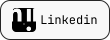

# What's up ✌🏻 Afonso here!

```html
<h2>  iOS Developer passionate about playing with code, btw BUY BITCOIN! 🤠 </h2>
```

&nbsp;

<p align="center">
  <a href="https://www.linkedin.com/in/afonso-lucas-49a57b261/" target="_blank">
    
  </a>
  &nbsp;
  <a href="https://medium.com/@afonso.script.sol" target="_blank">
    
  </a>
</p>

&nbsp;

- 🔭 I’m currently working on ➡️ **You'll know soon 😶**

- 🌱 I’m currently learning ➡️ **C, Objective-C, Neural Networks & LLM's.**

- 📝 Sometimes I write articles on ➡️ [https://medium.com/@afonso.script.sol](https://medium.com/@afonso.script.sol)

- 📫 How to reach me ➡️ **ifonso.developer@gmail.com**

- ⚡ Fun fact ➡️ **My `Hello, World!` in any programming language is a simple web server.**

&nbsp;

<p align="center">
  <samp>Songs that I'm listening (right now)</samp>
</p>

<div align="center">
  
</div>


&nbsp;

<p align="center">
  <samp><b>"Think different"</b> they said, bro if I try harder than that they would call me crazy 😶</samp>
</p>

&nbsp;

<div align="center">
  
</div>
